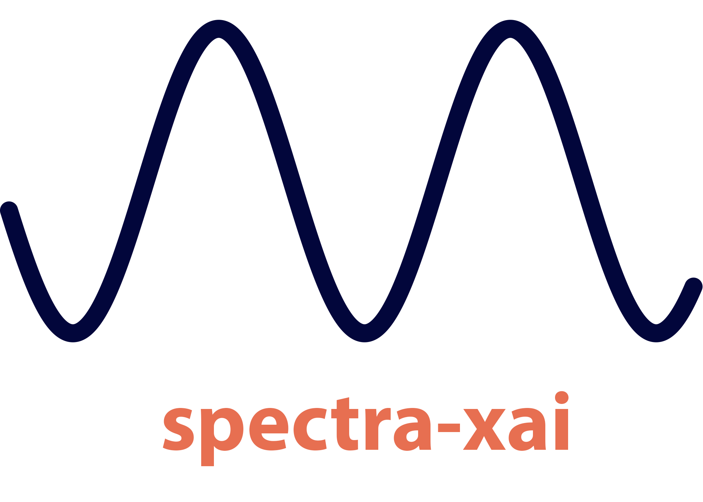

<!--
SPDX-FileCopyrightText: 2025 Nikos Tsakiridis <tsakirin@auth.gr>

SPDX-License-Identifier: GPL-3.0-or-later
-->

<a id="readme-top"></a>


[](https://dev.azure.com/i-bec/spectra-xai/_build/latest?definitionId=1&branchName=main)
[![Issues][issues-shield]][issues-url]
[![License][license-shield]][license-url]


<!-- PROJECT LOGO -->
<br />
<div align="center">
  <a href="https://github.com/i-bec-org/spectra-xai">
    
  </a>

  <h3 align="center">eXplainable Artificial Intelligence for spectral datasets</h3>

  <p align="center">
    An awesome python library to jumpstart your AI models!
    <br />
    <a href="https://portfolio.i-bec.org/spectraxai/spectraxai.html"><strong>Explore the docs »</strong></a>
    <br />
    <br />
    <a href="https://github.com/i-bec-org/spectra-xai">View Demo</a>
    &middot;
    <a href="https://github.com/i-bec-org/spectra-xai/issues/new?labels=bug&template=bug-report---.md">Report Bug</a>
    &middot;
    <a href="https://github.com/i-bec-org/spectra-xai/issues/new?labels=enhancement&template=feature-request---.md">Request Feature</a>
  </p>
</div>


<!-- TABLE OF CONTENTS -->
<details>
  <summary>Table of Contents</summary>
  <ol>
    <li>
      <a href="#about-the-project">About The Project</a>
      <ul>
        <li><a href="#built-with">Built With</a></li>
      </ul>
    </li>
    <li>
      <a href="#getting-started">Getting Started</a>
      <ul>
        <li><a href="#prerequisites">Prerequisites</a></li>
        <li><a href="#installation">Installation</a></li>
      </ul>
    </li>
    <li><a href="#usage">Usage</a></li>
    <li>
      <a href="#contributing">Contributing</a>
      <ul>
        <li><a href="#use-of-pre-commit">Use of pre-commit</a></li>
        <li><a href="#running-tests">Running tests</a></li>
        <li><a href="#building-documentation">Building documentation</a></li>
      </ul>      
    </li>
    <li><a href="#license">License</a></li>
    <li><a href="#contact">Contact</a></li>
    <li><a href="#acknowledgments">Acknowledgments</a></li>
  </ol>
</details>


<!-- ABOUT THE PROJECT -->
## About The Project


This library was developed to rapidly prototype and test various AI models across different spectral pre-treatments. It features:

* Spectral pre-processing or pre-treatment
* Dataset splitting into training and independent test sets
* Model training and optimization of the algorithms' hyperparameters
* Pre- and post-hoc explainability analysis including plotting of feature importance

<p align="right">(<a href="#readme-top">back to top</a>)</p>


### Built With

A number of different open source python packages are used like:

[![Numpy][Numpy-shield]][Numpy-url]
[![Scikit][Scikit-shield]][Scikit-url]
[![Pandas][Pandas-shield]][Pandas-url]

<p align="right">(<a href="#readme-top">back to top</a>)</p>


<!-- GETTING STARTED -->
## Getting Started

To get a local copy up and running follow these simple example steps.

### Prerequisites

Note that the cubist dependency requires a C compiler; in a Debian-based OS one can install it via:
```
sudo apt install build-essential
```

### Installation

1. On a new conda environment or virtualenv run:
   ```
   git clone https://github.com/i-bec-org/spectra-xai
   cd spectra-xai && pip install .
   ```
   _or_ run
   ```
   python setup.py install
   ```

2. [Optional] To install the development packages (e.g., if you want to edit this library) use:
    ```
    pip install -e .[dev]
    ```

<p align="right">(<a href="#readme-top">back to top</a>)</p>


<!-- USAGE EXAMPLES -->
## Usage

Some examples of the usage of this library may be found under the [examples](examples) folder.

_For more examples, please refer to the [Documentation](https://portfolio.i-bec.org/spectraxai/spectraxai.html)_

<p align="right">(<a href="#readme-top">back to top</a>)</p>


<!-- CONTRIBUTING -->
## Contributing

Contributions are what make the open source community such an amazing place to learn, inspire, and create. Any contributions you make are **greatly appreciated**.

If you have a suggestion that would make this better, please fork the repo and create a pull request. You can also simply open an issue with the tag "enhancement".

1. Fork the Project
2. Create your Feature Branch (`git checkout -b feature/AmazingFeature`)
3. Commit your Changes (`git commit -m 'Add some AmazingFeature'`)
4. Push to the Branch (`git push origin feature/AmazingFeature`)
5. Open a Pull Request


### Use of pre-commit

Please note that a number of different pre-commit hooks are used to automatically keep the project in its proper state.
If you wish to submit a pull request it's recommended to install pre-commit locally and run them, i.e.:

```
pre-commit run --all-files
```

### Running tests

Tests may be run through command line by executing e.g.:

```
pytest --ignore=examples --doctest-modules --html=report.html --cov=. --cov-report=html
```

### Building documentation

Documentation may be generated via:

```
pdoc --docformat numpy --math -o docs spectraxai
```

<p align="right">(<a href="#readme-top">back to top</a>)</p>


<!-- LICENSE -->
## License

This project is licensed under the terms of the **GNU General Public License v3.0 or later (GPL-3.0-or-later)**. See the [LICENSES/](LICENSES/) directory for the full license text and additional license information.

Some files (e.g., documentation) are licensed under the **Creative Commons Attribution-ShareAlike 4.0 International License (CC-BY-SA-4.0)**. These files are explicitly marked with their respective license headers.

<p align="right">(<a href="#readme-top">back to top</a>)</p>


<!-- CONTACT -->
## Contact

[Nikos Tsakiridis](https://tsakirin.webpages.auth.gr/) - tsakirin@auth.gr

<p align="right">(<a href="#readme-top">back to top</a>)</p>


<!-- ACKNOWLEDGMENTS -->
## Acknowledgments

This library was made possible through funding from the European Union as it was developed within the framework of several research projects, including:
* [EIFFEL](https://www.eiffel4climate.eu/) (European Union’s Horizon 2020 research and innovation programme under Grant Agreement Νο 101003518)
* [Soils4Africa](https://www.soils4africa-h2020.eu/) (European Union’s Horizon 2020 research & innovation programme under Grant Agreement No. 862900)
* [BACCHUS](https://bacchus-project.eu/) (European Union’s Horizon 2020 research and innovation programme under Grant Agreement No 871704)

<p align="right">(<a href="#readme-top">back to top</a>)</p>


<!-- MARKDOWN LINKS & IMAGES -->
<!-- https://www.markdownguide.org/basic-syntax/#reference-style-links -->
[issues-shield]: https://img.shields.io/github/issues/i-bec-org/spectra-xai.svg
[issues-url]: https://github.com/i-bec-org/spectra-xai/issues
[license-shield]: https://img.shields.io/badge/license-GPLv3-blue
[license-url]: https://github.com/i-bec-org/spectra-xai/blob/master/LICENSE.txt
[Scikit-shield]: https://img.shields.io/badge/scikit%20learn-F7931E?style=for-the-badge&logo=scikit-learn&logoColor=white
[Scikit-url]: https://github.com/scikit-learn/scikit-learn
[Numpy-shield]: https://img.shields.io/badge/Numpy-777BB4?style=for-the-badge&logo=numpy&logoColor=fff
[Numpy-url]: https://github.com/numpy/numpy
[Pandas-shield]: https://img.shields.io/badge/Pandas-150458?style=for-the-badge&logo=pandas&logoColor=fff
[Pandas-url]: https://github.com/pandas-dev/pandas
